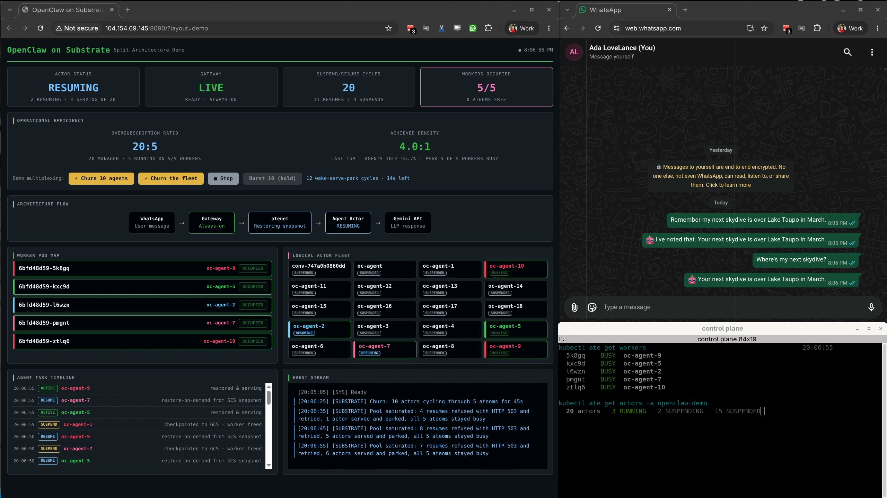

# OpenClaw on Agent Substrate

Run OpenClaw personal-AI-assistant instances on GKE with [Agent Substrate](https://github.com/agent-substrate/substrate),
minimizing compute cost. OpenClaw agents are idle >95% of the time but must appear
online 24/7 for channels like WhatsApp. We resolve that by **splitting presence
from cognition**: an always-on gateway holds the channel connections, while the
expensive agent runs as a suspendable Substrate actor. The gateway suspends it
once the conversation goes idle, and the next message auto-resumes it on demand.

See [`docs/ARCHITECTURE.md`](docs/ARCHITECTURE.md) for the full design and tradeoffs (with diagrams).

## Demo

[](https://www.youtube.com/watch?v=D5a9tyPkaPY)

Two minutes, with narration. A WhatsApp message wakes an agent that is not
running, it answers from restored conversation state, checkpoints itself once the
conversation goes quiet, and then ten agents cycle through five machines while the
control plane is queried alongside.

Watch on [YouTube](https://www.youtube.com/watch?v=D5a9tyPkaPY), or download
[`docs/always-on-agents-demo.mp4`](docs/always-on-agents-demo.mp4) (3.7 MB, 1440p).

## How it integrates

### A drop-in plugin: zero edits to existing OpenClaw files
Everything lives in `extensions/substrate/`. Copy it into OpenClaw's `extensions/`
and enable it in `openclaw.json`. Config is declared in the plugin manifest
(`openclaw.plugin.json` → `configSchema`) and startup wiring runs through
OpenClaw's plugin service + hook API, so **no core OpenClaw file is modified**:
no changes to config types, Zod schema, `server.impl.ts`, channels, agents, or
skills.

```bash
cp -r extensions/substrate <openclaw>/extensions/substrate
# or bundle into the image:  docker build --build-arg OPENCLAW_EXTENSIONS=substrate ...
```

Then set `plugins.entries.substrate` in config (see `extensions/substrate/README.md`).

The same logic can be wired straight into an OpenClaw build instead, as a
`src/substrate/` module plus about 30 lines of config and startup plumbing. That
was the original shape here and the plugin supersedes it, so it is not in this
repo.

## Repo layout

| Path | What |
|------|------|
| `extensions/substrate/` | The drop-in OpenClaw plugin (manifest, ACP backend, actor provisioner, idle suspender) |
| `manifests/` | Substrate + gateway K8s resources (WorkerPool, ActorTemplate, gateway, ingress) |
| `build/` | Image build: gateway/actor Dockerfiles, Cloud Build configs, actor image inputs (`build/actor/`) |
| `demo/` | WhatsApp demo config + deploy script + live dashboard |
| [`docs/`](docs/ARCHITECTURE.md) | Architecture doc + diagrams |

## Quick start (demo)

1. Install Substrate on a GKE cluster from a Substrate checkout with
   `hack/install-ate.sh --deploy-ate-system`. Create the cluster with the
   PodCertificate beta APIs enabled, and set up the snapshot bucket and its IAM
   first; see [`demo/README.md`](demo/README.md) Step 1. (The packaged installer
   at [`ai-on-gke/substrate-gke`](https://github.com/ai-on-gke/substrate-gke) does
   all of that for you, but its pre-built image track is not usable yet.)
2. `export PROJECT_ID=… GCS_BUCKET=… GEMINI_API_KEY=…`
3. `cd demo && ./deploy-demo.sh` builds the images, pins them by digest, deploys
   the WorkerPool, ActorTemplate, and gateway, then prints next steps (link
   WhatsApp, send a message). See [`demo/README.md`](demo/README.md) for the full
   walkthrough.

## For a harness company adopting this

- **Copy `extensions/substrate/`** into your OpenClaw tree (or bundle via
  `OPENCLAW_EXTENSIONS`). No other OpenClaw code changes.
- **Config only, per deployment**: set `plugins.entries.substrate` on the gateway
  (atespace, golden template, actor token, idle timeout) and ACP bindings in
  `openclaw.json`. The actor image runs stock OpenClaw with no plugin.
- **On the Substrate side** (targets current OSS `agent-substrate/substrate`,
  CRD group `ate.dev`): apply the `WorkerPool` + `ActorTemplate` manifests
  (`ate.dev/v1alpha1`), point the gVisor `SandboxConfig` at a runsc build that
  survives a heavy multi-process Node.js actor, and apply the control-plane
  changes below. Actors use the **atespace** model
  (`kubectl ate create atespace <a>; kubectl ate create actor <n> -a <a> --template-ref <name>`)
  and are reached at `<actor>.<atespace>.actors.resources.substrate.ate.dev`.

### Substrate control-plane changes needed (verified working, submittable upstream)

| Component | Change | Why |
|---|---|---|
| `atecontroller` golden flow | golden warmup made env-configurable (`ATE_GOLDEN_WARMUP_SECONDS`, ~120s) | 20s default checkpoints OpenClaw before it finishes pre-warming under gVisor |
| `atenet` `xds.go` | route timeout 10s→300s; ext_proc message timeout 5s→60s | long LLM turns; cold restore-on-demand of a large snapshot |
| `atenet` `resumer.go` | background resume timeout 15s→120s | a ~60 MiB cold restore exceeded 15s → 504 that *cancelled* the restore |
| `ateom-gvisor` `runsc.go` | drop `-allow-connected-on-save` on `runsc start` (version-gate upstream) | the GKE-Sandbox runsc build rejects the flag → `runsc start` exit 2 |
| `SandboxConfig` (gvisor) | runsc → GKE-Sandbox build | public gvisor.dev releases crash OpenClaw's sentry ~30–60s in; the GKE build keeps it alive and checkpoints it |
| OpenClaw substrate integration | null-guard `deps.chatAbortControllers?.size` in the idle-suspend activity check | `undefined` under this OpenClaw build → uncaught exception crashed the actor ~5s after boot |

The current-OSS `atelet` already discovers snapshot files dynamically
(`listSnapshotFiles`), so it handles the GKE runsc's single combined
`checkpoint.img` with no change.

Because the plugin integrates *below* the framework via OpenClaw's own ACP
protocol and plugin API, community-maintained channels/agents/skills, including
future ones, work unmodified.

## Contributing

See [`CONTRIBUTING.md`](CONTRIBUTING.md). Substrate control-plane gaps go
upstream as issues rather than as patches carried here; the running list is in
[`substrate-patches/README.md`](substrate-patches/README.md).

## License

Apache License 2.0. See [`LICENSE`](LICENSE).

## Trademarks

[OpenClaw](https://github.com/openclaw/openclaw) is an independent open-source
project (MIT-licensed). This repository provides an integration that runs
OpenClaw on Agent Substrate; it is **not affiliated with, sponsored by, or
endorsed by** the OpenClaw project. "OpenClaw" and any related names or logos are
the property of their respective owners and are used here only descriptively to
identify the software being integrated.
